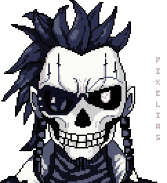

    
     
     
    
「 0x4652414D4520544841542 」

    

        
        
        
    

    <code>~# like a chimaera of the slumbering fancy</code>

 

## $ cat overview.txt

A CLI-inspired, single-page website showcasing my projects, skills, literary works, and other fun stuff.

 

    
## $ ls -la features/

| Feature | Description |
|:-------:|:------------|
| **CLI-style** | with 2 palettes |
| **Music Player** | custom playlist |
| **Skills View** | focus areas and radar chart |
| **Project Showcase** | github repos |
| **Literary Works** | exhibition |
| **Responsive Design** | all devices (hopefully) |

 

#

    <h4>© 2025 BXAVABY • Licensed under <a href="https://creativecommons.org/licenses/by-nc/4.0/">CC BY-NC 4.0</a></h4>
    <table>
        <tr>
            <td align="right"><strong>Art:</strong></td>
            <td align="left"><a href="https://ko-fi.com/pixelias/gallery">Pixelias</a></td>
        </tr>
        <tr>
            <td align="right"><strong>Palettes:</strong></td>
            <td align="left">
                <a href="https://lospec.com/mikal-setip">"Evidence in Darkness"</a> by Mikal 
                <a href="https://lospec.com/enzo-gray">"robots are cool!"</a> by Enzo Gray
            </td>
        </tr>
    </table>
     

